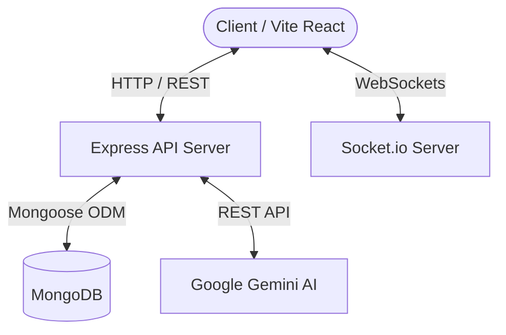

# 🚀 SkillSync

> **A Skill-Based Student Collaboration & Intelligent Project Matching Platform**

SkillSync connects students, developers, and creators based on verified skills, project requirements, and algorithmic matching. It streamlines team formation, project tracking, skill verification via AI quizzes, and real-time collaboration.

---

## ✨ Features

- **⚡ Intelligent Project Matching**: Uses cosine similarity over normalized skill vectors to calculate match scores (%) between users and open project requirements.
- **🤖 AI-Powered Roadmaps**: Integrates Google Gemini API to dynamically generate week-by-week project roadmaps tailored to team skills and deadlines.
- **🎯 AI Skill Verification**: Challenging skill quizzes generated on-the-fly by AI with automated evaluation and verified skill badges.
- **💬 Real-Time Messaging & Direct Messaging**: Instant project room chat and peer DMs powered by Socket.io.
- **📊 Analytics & Activity Logger**: Tracks member skill coverage, project progress, team capacity, and endorsements.
- **🔒 Secure Authentication & Role Management**: JWT authentication with password hashing (`bcryptjs`), input validation, and security headers (`helmet`).

---

## 🛠️ Tech Stack

### Frontend
- **Framework**: React 18 (Vite) + React Router v6
- **Styling**: Vanilla CSS, Glassmorphism, CSS Custom Properties
- **State & Realtime**: React Context API, Socket.io Client
- **Notifications & UI**: React Hot Toast, Lucide Icons

### Backend
- **Runtime**: Node.js & Express
- **Database**: MongoDB with Mongoose ODM
- **Realtime**: Socket.io
- **AI Integration**: Google Gemini API (`gemini-flash-latest`)
- **Security**: JWT, BcryptJS, Helmet, Express Rate Limit, Express Validator

---

## 🏗️ Architecture



---

## 🚀 Quick Start

### Prerequisites
- Node.js (v18+ recommended)
- MongoDB running locally or a MongoDB Atlas connection URI
- Google Gemini API Key

### 1. Clone & Setup Server

```bash
cd server
npm install
```

Create a `.env` file in `server/`:

```env
PORT=5000
MONGO_URI=mongodb://localhost:27017/skillsync
JWT_SECRET=your_super_secret_jwt_key
GEMINI_API_KEY=your_gemini_api_key
```

Start the backend:
```bash
npm run dev
# or: node index.js
```

### 2. Setup Client

```bash
cd ../client
npm install
```

Start the frontend:
```bash
npm run dev
```

Open [http://localhost:5173](http://localhost:5173) in your browser.

---

## 📡 API Overview

| Method | Endpoint | Description |
|--------|----------|-------------|
| `POST` | `/api/auth/register` | Register new user account |
| `POST` | `/api/auth/login` | Authenticate user & get JWT |
| `GET`  | `/api/users/me` | Fetch authenticated user profile |
| `GET`  | `/api/projects` | Get recent projects (paginated) |
| `POST` | `/api/projects` | Create a new project |
| `GET`  | `/api/projects/:id/matches` | Get AI-matched candidates for a project |
| `POST` | `/api/verify/challenge` | Generate an AI skill quiz |
| `POST` | `/api/roadmap/:projectId/generate` | Generate AI project roadmap |
| `GET`  | `/api/health` | Health check & uptime status |

---

## 🧪 Running Tests

```bash
cd server
npm test
```

---

## 📜 License

Distributed under the ISC License.
